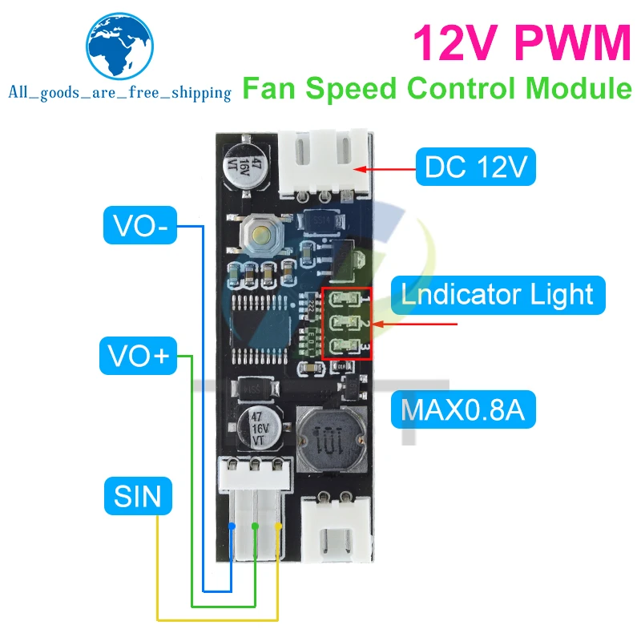

# Intent
The main intent of this solution is to provide the functionality similar to [PC Fancontrol](https://github.com/hrandib/pc_fancontrol) service but in hardware. There are a lot of equipment around which have fans and are quite noisy for no particular reason. Some of them even have fan controllers but algo/control curve is usually awful. This module can solve this issue.

# Brief features
 - The module provides 2 fan control PWM channels.
 - The first channel optionally is able to control 2-3pin fans by regulating DC voltage
 - The second channel is PWM only, this is PCB only limitation (4-pin fans)
 - Channels have independent configuration but can use shared sensors
 - Up to 8 sensors are supported, 4 sensors of type LM75 and 4 sensors of type DS18B20
 - Each controller channel can use up to 4 sensors of any type
 - Controller define:
   - poll period
   - algorithm: PI, 2-Point
   - sensors binding
   - MIN and MAX limits for PWM
   - EMA filtering, etc
 - The module configuration is performed via UART using PC side Python utility, it uses YAML format for the store/upload

# The Basic Workflow
1. Connect all the sensors to the board
2. Connect the board to PC and set active channels, e.g if you won't use the first channel it can be disabled. The command expects the list of active channel numbers separated by space

```shell
python .\fanutil.py -p tty... -e 0 1
```
3. Optionally mark channels as analog, it's needed only for proper display in configuration file, functionality is not affected. The command expects the list of analog channel numbers separated by space, an empty means all channels are PWM 

```shell
python .\fanutil.py -p tty... -a 0
```

4. Read current configuration, it'll contain all recognized sensors and controllers template.</br>The sample config is available [here](./datasheet/sample.yaml)

```shell
python .\fanutil.py -p tty... -r fanconfig.yaml
```


5. Edit the configuration file according to the fields description
6. Upload it to the board

```shell
python .\fanutil.py -p tty... -w fanconfig.yaml
```

# Possible alternatives


China market already provides various standalone fan control modules for less than 3 bucks.<br/>In many cases it's enough to solve the issue, but there are cases that can't be covered:
 - Multiple temperature measure points required
 - Multiple controller channels required with ability to share sensors
 - Other than 2-Point algo required, e.g to stabilize the temperature on the certain level
